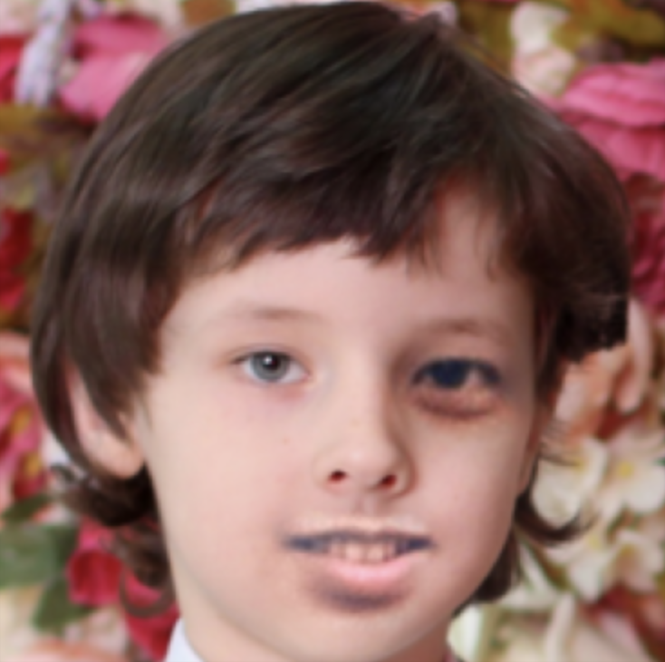
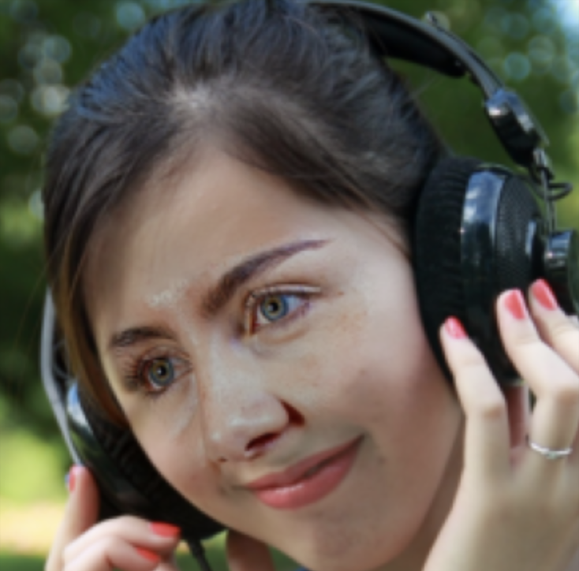
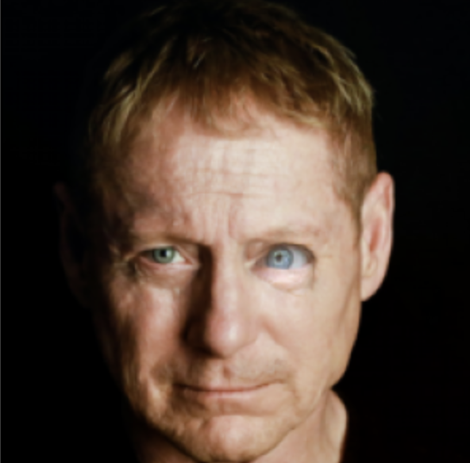
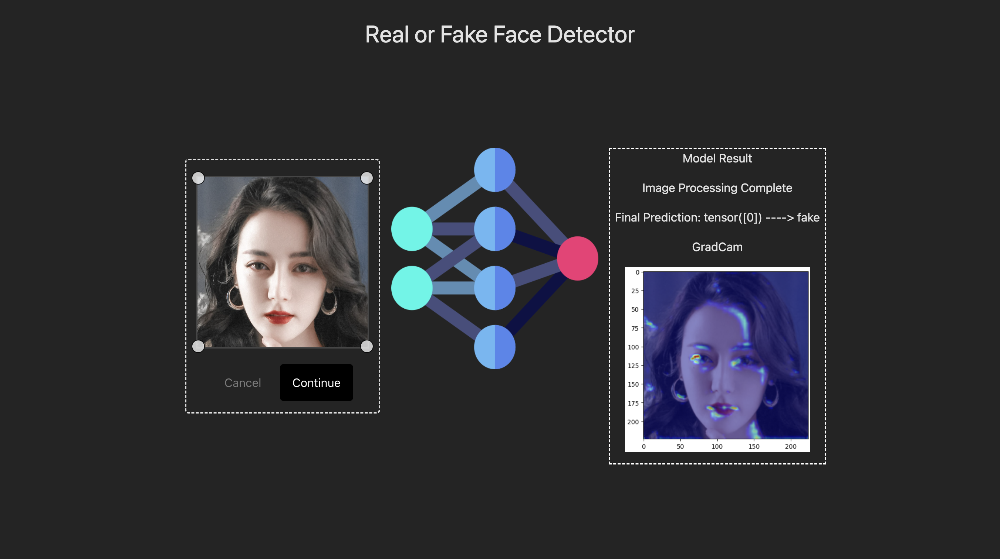
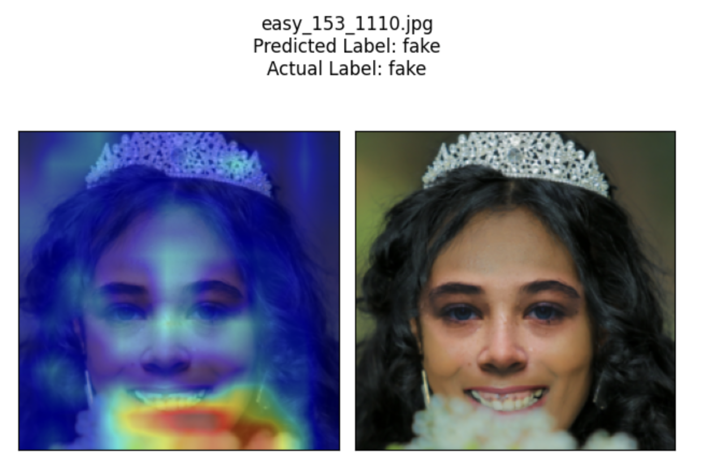
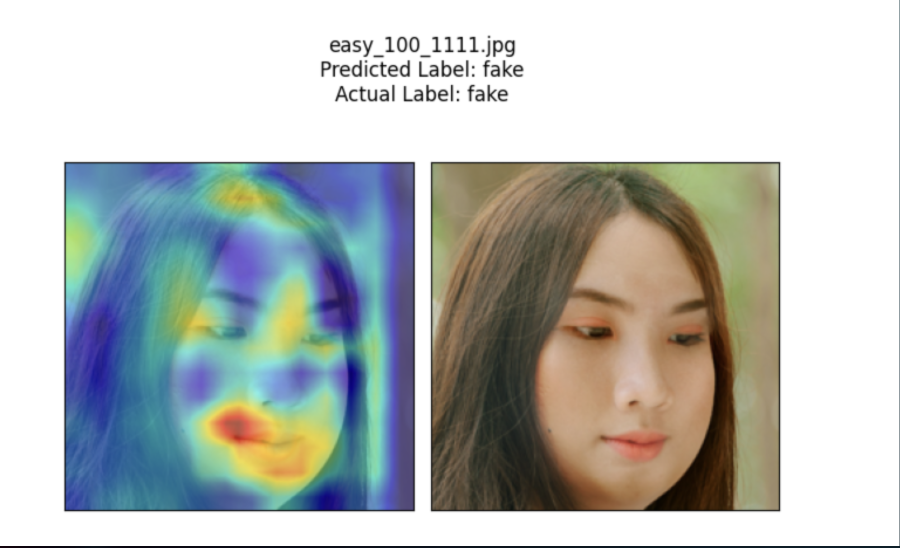
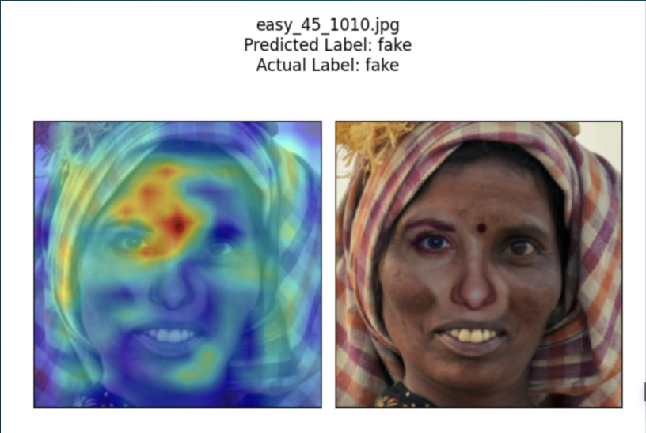
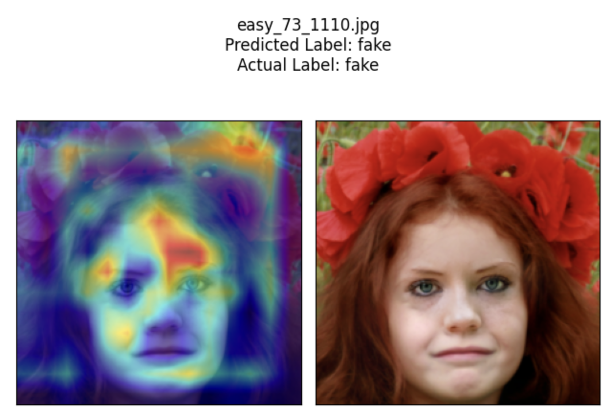
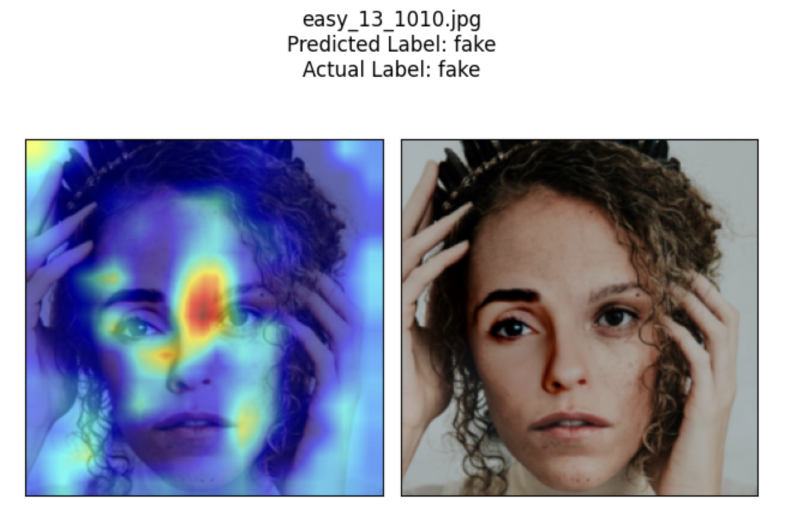
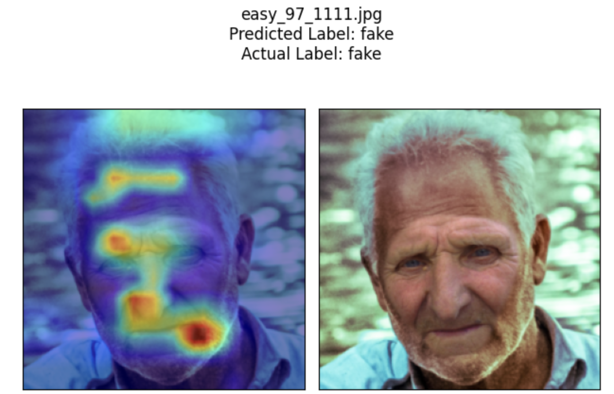

  
  <h2 align="center">MDST RvF 2023</h2>
  
Are these faces photoshopped? 

  

  
  
  

## Team

Weile weilez@umich.edu [Weile-Zheng](https://github.com/Weile-Zheng) Model Designing, Web Development

Avi avibhatt@umich.edu [avi22bhattacharya](https://github.com/avi22bhattacharya) Model Desigining

Sam tansam@umich.edu [Toshihiko-tan](https://github.com/Toshihiko-tan) Model Designing

Nathan tkdang97@gmail.com [dangk01](https://github.com/dangk01) Model Tuning

Dennis dennisfj@umich.edu [dennisfarmer](https://github.com/dennisfarmer) Model Designing, Web Development

[Presentation Slides](https://docs.google.com/presentation/d/14KdpuFMqFfnKe5M7K4QRyPROVCyOtDu0aSvHb-bYHrQ/edit?usp=sharing)

## GradCam Showcase

  
  
  
  
  
  

